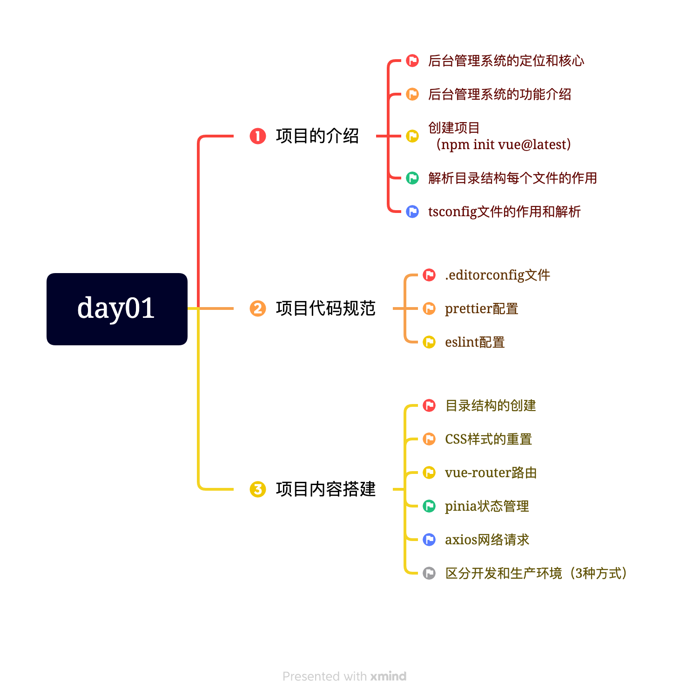
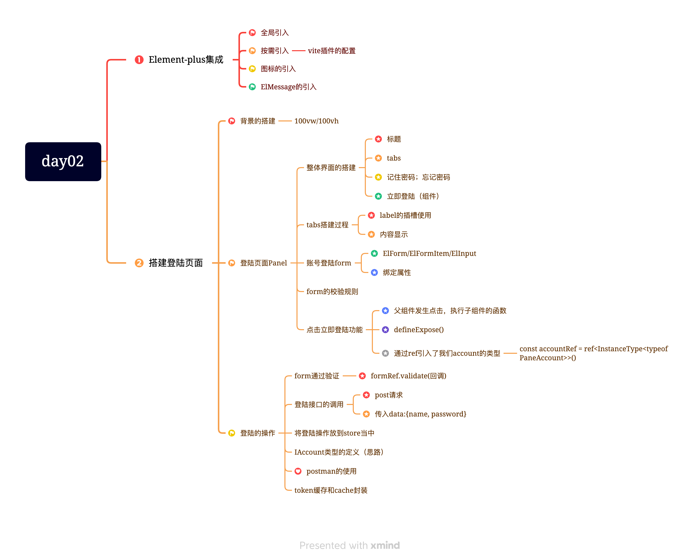
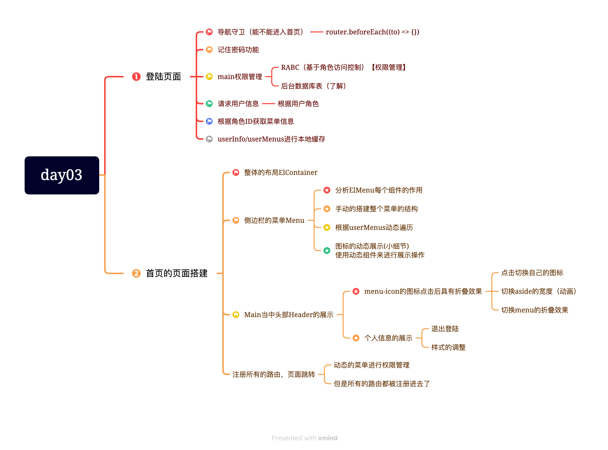
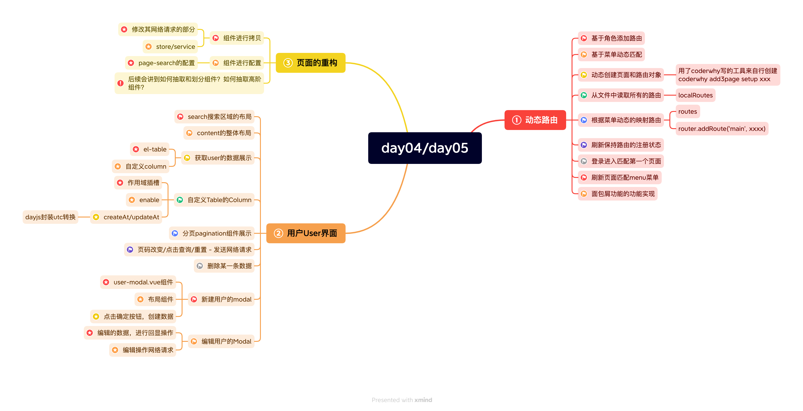
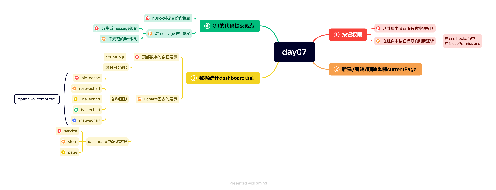

# BMS_Project_02
Vue3 + TypeScript （CodyWhy）

# 项目实现效果图


# 项目介绍
## 项目文件介绍
- 上面的每一个文件夹都是一个项目；项目我分为了7次来一次次完成，每一次写完一部分都会用一文件夹保存；
## 技术点
-  Vue3 + TypeScript + Element Plus + Pinia + Vue Router + Axios + Echarts + Vite

## 项目介绍
- 此项目通过不同的角色登陆到后台管理系统，根据自己角色的权限对数据进行添加、编辑、删除及看到相
关数据的可视化界面；主要分为系统总览、系统管理、角色中心、随便聊聊几大模块，方便用户操作。

## 主要职责
1. 基于角色权限的不同来动态添加路由，以展示不同的后台菜单页面；
  - **每个页面都有其对应的路由(在每个对应的文件夹中都书写了自己的路由信息)；一般的做法：在注册路由信息中都写死了这些页面路由；我们的做法：通过不同的用户，登陆到后台管理系统中的权限不同获取到的菜单来动态决定是否加载路由**
  - 目前的路由信息都是放在一个个独立文件中；之前全部放在一个数组中，方便获取；
  - 根据菜单信息来获取我们想要的路由信息；先获取本地的路由信息localRoutes，在获取服务器给我们返回的菜单信息中的路由；比较菜单信息中路由的url 和 本地路由信息的 path；看它们是否匹配；
  - 匹配的话；routes.forEach((route) => router.addRoute('main', route))即可
!!! 2023/08/29
**动态路由**; 根据用户的权限管理,动态的添加路由(而不是一次性的注册所有的路由)
1. 基于角色(Role)
2. 基于菜单的动态路由管理(合理)
* userMenus => 动态展示菜单
* 核心技术/商品统计/用户管理
* 映射成路由对象

**前端开发者**: 路由映射的时候,为了满足所有的进入系统的用户,需要注册所有的路由. 弊端: 手动输入路径,其实也是可以进入到页面中的; 


登陆的接口中请求三个内容:
1. token
2. 用户信息/角色信息(role对象)
3. 菜单信息

2. **按钮的权限管理**：不同角色数据对数据的操作权限不同（），**为了提升用户体验**；根据用户操作权限来决定页面中增删改操作的图标是否展示；
  - 新建用户界面，会给用户分配不同的权限
  - userMenus该服务器获取到的数据中已经包含了用户权限
    - 通过什么来判断呢？ 1、id（动态生成的，不好）2、name（文本的东西不好）3、后台专门设置好了 permission；设置成唯一的；
    - 如何操作？
      - 之前的菜单数据把左侧菜单映射出来了
      - 按钮权限还没有拿到；**获取登陆用户的所有按钮的权限**
        - 刷新不等于登录；要想刷新后依然拿到数据，可以在第一次登陆以后将数据缓存起来
  - 进入到某个页面怎么判断权限
    - page-content.vue这个组件是最有代表的；增删改查
    - 创建4个权限变量;通过v-if来判断是否展示；**查询权限**操作fetchPageListData()方法；没有的话直接return 
    ```
    // 0.获取是否有对应的增删改查的权限
    const isCreate = usePermissions(`${props.contentConfig.pageName}:create`)
      - const loginStore = useLoginStore()
      - const { permission } = loginStore
      - const isCreate = permission.find((item) => item.includes('department:create')) // 写死了
      - const isCreate = permission.find((item) => item.includes(`${props.contentConfig.pageName}:create`))
    const isDelete = usePermissions(`${props.contentConfig.pageName}:delete`)
    const isUpdate = usePermissions(`${props.contentConfig.pageName}:update`)
    const isQuery = usePermissions(`${props.contentConfig.pageName}:query`)
    ```
    - 上述逻辑在别的页面也是需要实现的
    - **可以将这些逻辑抽取到hooks**当中
      - 代码也在上方
    - 每个配置中最好都传入相应的权限页面；pageName
  - 测试  
    - 角色管理中进行测试
      
3. 单一页面通常由上、下、弹出框三个子组件组成，将三个组件进行抽取，后续通过传入某一页面的动态配置信息

# 项目中所遇到的问题
## 对于自动到.git文件中的文件上传自github上出现向右白色箭头无法点击访问的情况
**处理方案**
- 使用命令或者进入文件夹手动删除文件夹里面的.git 文件夹
- 执行 git rm --cached [文件夹名]
- 执行 git add [文件夹名]
- 执行 git commit -m "msg"
- 执行 git push || git push origin [branch_name]

# 每日学习内容（思维导图）
## day01


### 项目知识点复习day01
1. 在 Vue 项目中，.tsconfig 文件是 TypeScript 编译器的配置文件。它用来设置 TypeScript 编译器的编译选项和行为，以便将 TypeScript 代码转换为 JavaScript 代码。（用来设置TS编译器的编译选项和行为）
2. 项目规范其实只要配置好其中一个就行了
3. 项目结构的初始搭建：views文件夹下的 main、login、not-found等组件的搭建
4. CSS样式的重置（这一点很关键）
5. vue-router路由的使用：先npm下载好路由；然后在router文件夹下面的index.ts文件下配置（使用vue3的组合式API进行配置路由**createRouter**，使用 **createWebHashHistory**创建路由方式等）；同时还需要在main.ts中进行注册使用
6. pinia状态管理： 在store文件夹下进行管理操作；配置文件书写在index.ts文件夹下【将创建好的“pinia”导出】；
7. axios网络请求：之前已经封装过了；
8. 区分开发环境和生产环境：3种方式～demo中见

## day02


### 项目知识点复习day02
1. Element-plus的引入在main.ts中进行引入操作; **按需引入; 需要安装两个插件,还需要在vite.config.ts中进行相关内容的配置**
2. CSS中vw和vh的使用；解释: 项目中的100vw和100vh表示的就是占满整个屏幕
```
在 CSS 中，vw 和 vh 都是相对于视口大小的长度单位。

vw 表示视口宽度的百分比，即 1vw 等于视口宽度的 1%。例如，如果视口宽度为 1000 像素，则 1vw 等于 10 像素。

vh 表示视口高度的百分比，即 1vh 等于视口高度的 1%。例如，如果视口高度为 800 像素，则 1vh 等于 8 像素。

这两个单位可以用来创建响应式设计，以使元素在不同的设备和屏幕尺寸下保持一定的比例和布局。
```
3. label插槽的使用（有具体名字；使用具名插槽；使用template 然后用#label来标识；里面再使用class="label"来表示）
```
<template #label>
  <div class="label">
    <el-icon><UserFilled /></el-icon>
    <span class="text">帐号登录</span>
  </div>
</template>
```
4. 在登陆组件中（login-pane）；里面又划分嵌套了两个子组件（pane-account）和（pane-phone）
5. 登陆组件的校验规则：el-form组件中的:rules是用来书写配置规则用的；具体实现可以查看文档；**其实element-plus已经很好的适配vue3和ts了, 比如密码校验规则那些都已经被封装好了**
6. 点击立即登陆的功能：在父组件中进行点击；在子组件中配置好ref属性，可以很完美的拿到 <pane-account ref="accountRef" />子组件上的方法，在子组件中需要通过defineExpose把方法暴露出去，具体的逻辑实现可以书写在子组件上；  
7. 获取到的数据最好是不要存放在组件自身上；因为别的组件也可能会用到；放到pinia当中；
8. 其中在pinia中actions中发送网络请求的时候可以用async和await配合使用，这样结果数据就能直接获取到；不用.then()
9. 一些公用的类型可以抽取到types文件夹当中；暴露文件一般是通过index.ts进行全局暴露；
10. 对于一些常用方法：比如使用localStorage、sessionStorage来对token数据做一个保留的时候，可以将这个方法写在utils文件夹当中；

## day03


### day03
- 很多公司都是根据登录进来的用户角色的不同来展示不同的信息;
- 拿到数据以后来进行相应的缓存操作即可; 进行本地缓存localCache
- 服务器如果返回的数据很乱的时候,**自己可以书写一个映射的工具函数来将很乱的数据映射成自己想要的格式数据**
- **动态路由的操作**;  选择组件当中的某一个类的时候,找不到的时候书写 :deep(某一个类名)
- 点击左侧菜单, 右边展示相应的页面,通过路由来实现,在合适的位置使用router-view来进行占用位置即可
  - 想要点击跳转的话,必须绑定点击函数才行;
```
<el-main>
  <router-view></router-view>
</el-main>
```
- 一开始的路由方案都是已经注册了相应的路由,比如说二级路由等;

## day04 & day05


### 项目知识点复习day04
1. 动态路由：根据用户的权限信息，动态的添加路由（而不是一次性的注册所有的路由）
- 基于的角色（Role）动态路由管理
```
const roles = {
  "superadmin":[所有的路由],=> router.main.children
  "admin":[一部分路由]
}
```
- *弊端：每增加一个角色；都要增加一个key/value 
- 登陆的接口中请求三个内容：token;用户信息：角色信息～role对象;菜单信息

2. 基于菜单(menu)的动态路由管理
- userMenus => 动态展示菜单
- 核心技术、商品统计、用户管理、角色管理

**总结**：第二种是更好的，更合适的

## day05
### 项目知识点复习
- 关于组件中的数据，想要获取最外面el-table的数据，可以使用作用域插槽
  - 作用域插槽，通过template，#default="scope"来获取；通过scope可以获取到所有的数据信息
```
<template #default="scope">
  <el-button
    size="small"
    :type="scope.row.enable ? 'primary' : 'danger'"
    plain
  >
    {{ scope.row.enable ? '启用' : '禁用' }}
  </el-button>
</template>
```
#### 项目知识点复习-table

## day06


## day07

