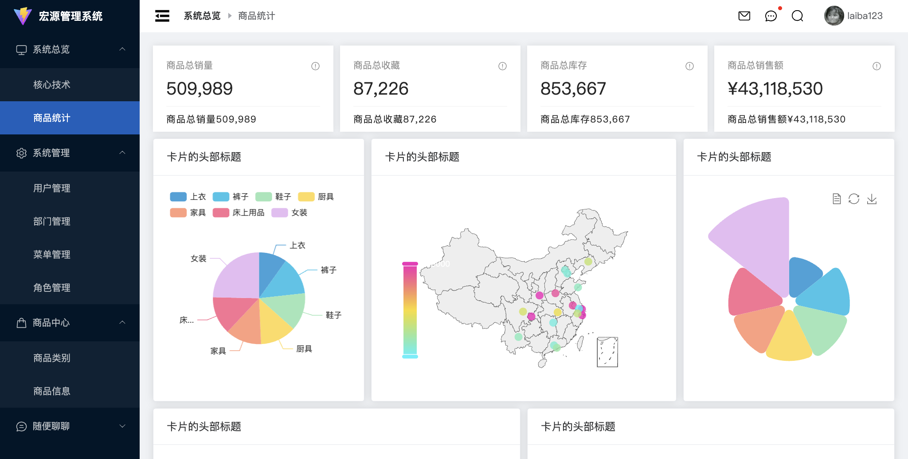

# BMS_Project_02
Vue3 + TypeScript （CodyWhy）

# 项目实现效果图


# 项目介绍
## 项目文件介绍
- 上面的每一个文件夹都是一个项目；项目我分为了7次来一次次完成，每一次写完一部分都会用一文件夹保存；
## 技术点
-  Vue3 + TypeScript + Element Plus + Pinia + Vue Router + Axios + Echarts + Vite

## 项目的逻辑结构
- .editorconfig; 通常用于定义代码编辑器和IDE的编码风格规则，以确保多个开发者在一个项目中能够保持一致的代码格式和样式。
- .env;
  - 用于配置环境变量。这些环境变量可以在项目中的不同环境中设置不同的值，以便控制应用程序的行为和配置。
- .env.development;
  - VITE_URL = dev; 意味着在开发环境中，你可以使用 VITE_URL 这个环境变量来访问 dev 或者任何你想要在开发环境中使用的值。
  - const url = import.meta.env.VITE_URL; // 在开发环境中，url 的值将会是 "dev"，因为它是从 .env.development 文件中获取的。
- .env.production
  - VITE_URL = prod；表示你为生产环境指定了一个名为 VITE_URL 的环境变量，并将其值设置为 prod。这意味着在生产环境中，你可以使用 VITE_URL 这个环境变量来访问 prod 或者任何你想要在生产环境中使用的值。
- .eslintrc.cjs； 通常用于配置 ESLint，一个用于检测和纠正 JavaScript 代码中潜在问题的工具。具体地，这个配置文件是一个 CommonJS 格式的配置文件，通常命名为 .eslintrc.cjs
```
require('@rushstack/eslint-patch/modern-module-resolution') // 导入了一个模块 @rushstack/eslint-patch/modern-module-resolution，这通常用于支持现代模块解析。这是一个特定于某些项目和工具链的配置，用于确保正确的模块解析行为。

module.exports = { // 这是配置对象的开始，包含了 ESLint 的规则和选项。
  root: true, // 表示这是 ESLint 配置的根文件，即它停止在父级目录中查找其他配置文件。
  extends: [  // 这是一个数组，包含了该配置文件继承的其他配置。它使用了多个 ESLint 插件和扩展配置，包括 Vue 3、JavaScript 标准规则、TypeScript、Prettier 等。这些配置将用于检查和格式化代码。
    'plugin:vue/vue3-essential', // 这是一个扩展配置，它包括了 Vue 3 项目中的一组必要的 ESLint 规则，以确保你的 Vue 3 组件的代码质量和一致性。
    'eslint:recommended',  // 是 ESLint 官方推荐的规则集合, 包含了一些通用的 JavaScript 代码规则，以帮助你避免常见的错误和最佳实践。
    '@vue/eslint-config-typescript', // Vue 团队维护的用于 TypeScript 项目的 ESLint 配置。它包括了与 TypeScript 相关的规则，以确保你的 TypeScript 代码的质量和一致性。
    '@vue/eslint-config-prettier', // 这个配置用于集成 Prettier 和 ESLint，以确保 ESLint 规则不与 Prettier 的代码格式规则发生冲突。它确保 ESLint 和 Prettier 可以一起协同工作，以格式化你的代码并检测代码质量问题。
    'plugin:prettier/recommended' // 这个扩展配置用于启用 Prettier 插件，它将在 ESLint 中集成 Prettier，并自动应用 Prettier 的格式规则，以确保代码风格一致。
  ],
  parserOptions: { // 这是一个对象，用于配置解析器选项。ecmaVersion: 'latest' 表示使用最新版本的 ECMAScript 标准。
    ecmaVersion: 'latest'
  },
  rules: {
    'vue/multi-word-component-names': 'off', // 关闭了 Vue 插件中的规则 
    'no-undef': 'off' // 关闭了全局未定义变量的检查规则。
  }
}
```
- .gitignore；文件是一个用来告诉 Git 哪些文件或目录应该被忽略，不被纳入版本控制的配置文件。在一个 Vite 构建的 Vue 3 项目中，.gitignore 文件的作用如下：
  - 排除不需要版本控制的文件：在项目中，有些文件和目录是自动生成的，或者包含敏感信息，或者是临时文件，这些通常不应该包括在版本控制系统中。.gitignore 文件用于指定这些文件和目录，以确保它们不会被提交到代码库。
  - 提高代码库的干净度：忽略不需要版本控制的文件可以帮助保持代码库的整洁性，只包括真正的源代码和必要资源文件。这可以使代码库更容易维护、更小巧、更易于协作和更快速。
  - 保护敏感信息：敏感信息如密钥、密码等通常不应该存储在代码库中。通过.gitignore 文件，你可以确保这些敏感信息不会被不小心提交到版本控制系统中，从而提高安全性。
- .prettierignore；文件是用于配置 Prettier 格式化工具的忽略规则的文件。Prettier 是一种代码格式化工具，它可以自动格式化代码，使其符合预定义的代码样式规则。
  - .prettierignore 文件的作用是告诉 Prettier 哪些文件或目录应该被忽略，不要格式化它们。 # 忽略构建产物  /dist/  /build/
- .prettierrc.json；文件是用于配置 Prettier 格式化工具的配置文件。Prettier 是一种代码格式化工具，它可以自动格式化代码，使其符合预定义的代码样式规则。
```
{
  "useTabs": false, // 这表示不使用制表符（tabs）作为缩进，而使用空格（space）来进行缩进。
  "tabWidth": 2, // 这定义了缩进宽度，表示每级缩进由 2 个空格组成。这是指定缩进大小的设置，适用于在代码中使用空格进行缩进的情况。
  "printWidth": 80, // 这是一行代码的最大字符数。如果一行的字符超过 80 个字符，Prettier 将尝试自动换行以确保不超过这个宽度。
  "singleQuote": true, // 这表示在代码中使用单引号作为字符串的引号风格，而不是双引号。例如，字符串将被格式化为 'example' 而不是 "example"。
  "trailingComma": "none", //  这指定了对象、数组、函数参数等地方是否允许尾随逗号。在这里，设置为 "none" 表示不允许尾随逗号。
  "semi": false // 这指定是否应在语句的末尾添加分号。在这里，设置为 false 表示不添加分号，这在一些 JavaScript 项目中是一种常见的风格。
}
```
- auto-imports.d.ts; 用于自动导入类型定义和模块，以提供更好的代码编辑体验和类型检查。这文件通常与 TypeScript 一起使用，特别是在 Vue 3 项目中，以提供类型推断和自动导入。
- commitlint.config.js; 用于配置 Commitlint，一个工具，它帮助规范化 Git 提交信息的格式，以便更好地跟踪和管理代码库的版本历史。在 Vue 3 项目中，使用 Commitlint 可以确保提交信息遵循一致的格式，以帮助开发团队更容易地理解每次提交的内容。
  - module.exports = { extends: ['@commitlint/config-conventional'] };   Conventional Commits 的一种标准配置，规定了提交信息的格式和类型
- components.d.ts; 用于声明自定义组件的类型，以帮助 TypeScript 在编译时提供类型检查和自动补全。这种类型声明文件通常用于增强 Vue 组件的类型安全性，确保组件的属性和方法在使用时是正确的。
```
declare module '@vue/runtime-core' {  // 导入了 Vue 3 的核心运行时库  这一行开始了模块声明，它告诉 TypeScript，接下来我们要为'@vue/runtime-core'模块增加类型声明。
  export interface GlobalComponents { // 这部分代码定义了一个全局类型接口 GlobalComponents，它包含了一些组件名称和类型的映射。
    BarEchart: typeof import('./src/components/page-echarts/src/bar-echart.vue')['default'] // BarEchart, BaseEchart, copy 是自定义组件的名称，它们映射到这些组件的类型。
    BaseEchart: typeof import('./src/components/page-echarts/src/base-echart.vue')['default']
```
- env.d.ts; 用于增强 TypeScript 在 Vue 3 项目中对环境变量的类型推断和自动补全。这个文件允许你定义项目中使用的环境变量的类型，以帮助 TypeScript 确保你在代码中正确地使用这些环境变量，从而提高类型安全性和开发效率。
```
declare module '*.vue' {
  import { DefineComponent } from 'vue' // 模块声明告诉 TypeScript 如何处理导入以 *.vue 结尾的文件。
  const component: DefineComponent //  导入了 Vue 3 的 DefineComponent 类型，用于定义 Vue 单文件组件的类型。
  export default component // 导出了默认的 component，表示它是一个 Vue 单文件组件。
  interface IModalConfig {} // 定义了一个空的接口 IModalConfig，这个接口在这个声明模块中可用。
  export { IModalConfig } // 导出了 IModalConfig 接口，以便其他模块可以访问它。
}

declare module '*.mjs' // 这个模块声明告诉 TypeScript 如何处理导入以 *.mjs 结尾的文件。这个声明没有提供具体的类型定义或导出，仅告诉 TypeScript 如何处理这种类型的模块。
```
- index.html；通常位于项目的根目录，并是整个前端应用的初始页面。当你在浏览器中访问应用时，浏览器会加载 index.html 文件，然后根据其中的内容加载和渲染应用的资源和内容，启动 Vue 3 应用。这个文件是前端项目的入口点，决定了网页的结构和行为。
  - <div id="app"></div>：这是一个<div>元素，其id属性设置为"app"。在典型的Vue.js应用中，Vue会挂载应用的根组件到这个<div>元素上。
  - <script type="module" src="/src/main.ts"></script>：这是一个JavaScript脚本标签，它引入了Vue.js应用的入口文件。type="module"表示这是一个ES6模块，src属性指定了入口文件的位置。
- package-lock.json；文件是用于确保项目的依赖关系的精确版本锁定的文件，通常用于 Node.js 项目中，包括 Vite 构建的 Vue 3 项目。以确保项目的依赖关系是稳定和一致的。这对于构建可维护的、
- package.json；它通常包含有关项目的元数据和依赖信息。 它不仅用于管理项目的依赖关系，还包含了有关项目的各种元数据和配置信息，从构建到发布，都与项目的生命周期密切相关。 这个配置的目的是，当开发者使用 git commit 命令来提交代码变更时，会启动 Commitizen 工具，并使用 cz-conventional-changelog 插件来引导他们创建符合约定的提交信息。
  - 项目元数据：package.json 文件包含有关项目的元数据，如项目的名称、版本号、作者、描述等。这些信息对于项目的文档、发布和维护都非常重要。
  - 依赖管理：package.json 文件列出了项目依赖的软件包，包括开发依赖和生产依赖。这些依赖描述了项目所需的第三方库和工具。
  - `package.json` 和 `package-lock.json` 是 Node.js 项目中的两个关键文件，用于管理项目的依赖关系和元数据。
    - 1. **package.json**：
     - `package.json` 是一个包含有关项目元数据的文件，如项目的名称、版本、作者、描述等。
     - 它还包含了项目的依赖关系，分为两种类型：
       - **生产依赖**：`dependencies` 字段包含了项目在生产环境中运行时需要的依赖。
       - **开发依赖**：`devDependencies` 字段包含了仅在开发和构建过程中需要的依赖，如构建工具、测试库等。
     - `package.json` 中的脚本字段（`scripts`）允许定义自定义命令，以运行各种开发和构建任务。
     - 该文件还可包含有关项目的许可证信息、存储库地址、脚本、依赖版本范围等。
    - 2. **package-lock.json**：
       - `package-lock.json` 文件是自动生成的，它记录了项目的精确依赖关系，包括依赖的版本和依赖树。
       - 这个文件的主要目的是确保项目在不同的开发环境和不同的机器上都使用相同版本的依赖。它锁定了每个依赖包的确切版本，以避免意外的依赖更新。
       - `package-lock.json` 还包含了关于每个依赖包的元数据，如下载地址、哈希值等，以便确保每次安装的依赖都是完全一致的。
    - **总之，`package.json` 包含项目的基本信息、依赖声明和自定义脚本，而 `package-lock.json` 用于确保项目的依赖关系在不同环境中的一致性。这两个文件在 Node.js 项目中非常重要，特别是在构建可维护的、稳定的应用程序时。**
- tsconfig.config.json； 文件是 TypeScript 的配置文件，用于指定 TypeScript 编译器的设置和选项。
```
{
  "extends": "@vue/tsconfig/tsconfig.node.json", // 这一行使用了继承配置，它扩展自 @vue/tsconfig/tsconfig.node.json 配置文件，意味着这个配置文件继承了 @vue/tsconfig/tsconfig.node.json 的所有设置。
  "include": ["vite.config.*", "vitest.config.*", "cypress.config.*"], // 这一行指定了 TypeScript 编译器应该包括在编译中的文件。具体来说，它包括了文件名匹配模式，用于匹配 vite.config.*、vitest.config.* 和 cypress.config.* 等文件。这通常用于确保这些文件中的 TypeScript 代码会被编译。
  "compilerOptions": { // TypeScript 编译器的配置选项。
    "composite": true, // 这个设置允许 TypeScript 使用增量编译（incremental compilation）来提高编译性能。
    "types": ["node"] // 这个设置指定了项目中要包括的类型声明文件。在这里，它包括了 Node.js 相关的类型声明，以便在项目中使用 Node.js 核心模块和 API。
  }
}
```
- tsconfig.json; 用于指定 TypeScript 编译器的设置和选项。这个配置文件通常位于 TypeScript 项目的根目录，并定义了如何编译 TypeScript 代码以及一些其他编译相关的行为。
```
{
  "extends": "@vue/tsconfig/tsconfig.web.json", // 这行配置使用了继承，它继承自 @vue/tsconfig/tsconfig.web.json 文件的配置，意味着这个配置文件继承了 tsconfig.web.json 中的所有设置。
  "include": ["src/**/*", "src/**/*.vue", "env.d.ts", "auto-imports.d.ts", "components.d.ts"], // 这里指定了应该包括在编译中的文件或文件夹的列表。这些文件包括了项目中的 TypeScript 文件、Vue 单文件组件、以及额外的 .d.ts 类型声明文件。
  "exclude": ["commitlint.config.js"], // 这里指定了应该排除在编译之外的文件。在这个示例中，排除了 commitlint.config.js 文件。
  "compilerOptions": { // 部分包含了 TypeScript 编译器的配置选项。
    "baseUrl": ".", //  指定了用于解析相对模块导入的基本目录
    "paths": {
      "@/*": ["./src/*"] // 指定了路径映射，允许缩短模块导入的路径。
    },
    // "types": ["element-plus/global"] // 被注释掉的这行通常用于指定要包括的类型声明文件。在这个示例中被注释掉，但通常用于引入第三方库的类型声明。
  },

  "references": [
    {
      "path": "./tsconfig.config.json" // 这部分指定了项目的引用关系。在这个示例中，它引用了另一个 tsconfig.config.json 文件，这用于处理项目的依赖关系。这意味着这个项目依赖于另一个项目。
    }
  ]
}
```
  - 在 Vite 搭建的项目中，`tsconfig.config.json` 和 `tsconfig.json` 都是 TypeScript 的配置文件，但它们在用途上通常有不同的含义：
    - 1. **tsconfig.json**：
       - `tsconfig.json` 是 TypeScript 的标准配置文件，用于指定 TypeScript 编译器的设置和选项。
       - 在 Vite 项目中，`tsconfig.json` 用于配置 TypeScript 编译器的行为，包括编译选项、类型检查、路径映射等。它定义了项目中 TypeScript 代码的编译规则。
       - 这个文件通常位于 TypeScript 项目的根目录，用于控制整个项目的 TypeScript 编译设置。
    - 2. **tsconfig.config.json**：
       - `tsconfig.config.json` 的名称中的 "config" 部分并没有特定的含义，它通常是 Vite 项目中的一个自定义配置文件，特别是用于配置 TypeScript 的路径别名。
       - 在 Vite 项目中，`tsconfig.config.json` 通常包含了与项目相关的 TypeScript 路径映射（alias）配置，以便在项目中使用别名来引用模块。这对于确保在开发期间正确处理模块路径非常有用。
    - 总之，`tsconfig.json` 是标准的 TypeScript 配置文件，用于控制 TypeScript 编译器的行为。而 `tsconfig.config.json` 在 Vite 项目中通常用于自定义 TypeScript 路径映射，以改善模块导入的可读性和维护性。这两个配置文件有不同的用途和内容，但它们共同用于确保 TypeScript 与 Vite 的集成工作良好。
- vite.config.ts；是一个配置文件，用于自定义和配置 Vite 项目的构建和开发行为。这个文件允许你对 Vite 的默认行为进行修改、添加插件、自定义路由、指定输出目录等等，以满足项目的特定需求。
```
import AutoImport from 'unplugin-auto-import/vite'
import Components from 'unplugin-vue-components/vite'
import { ElementPlusResolver } from 'unplugin-vue-components/resolvers'
import { // 这些导入语句用于配置 Vue 组件的自动导入和样式按需加载。ElementPlusResolver 和 ElementPlusResolve 是与 Element Plus UI 框架相关的解析器和样式加载器。
  createStyleImportPlugin,
  ElementPlusResolve
} from 'vite-plugin-style-import'

// https://vitejs.dev/config/
export default defineConfig({ // 这是配置文件的主体部分，使用 defineConfig 函数定义了 Vite 项目的配置。在这个配置对象中，可以定义各种项目的构建和开发行为。
  plugins: [ // 这里配置了项目中使用的 Vite 插件，包括 Vue 插件和自动导入相关的插件。这些插件可以提供不同功能，如 Vue 支持、自动导入模块、自动导入组件、按需加载样式等。
    vue(),
    AutoImport({
      resolvers: [ElementPlusResolver()]
    }),
    Components({
      resolvers: [ElementPlusResolver()]
    }),
    createStyleImportPlugin({
      resolves: [ElementPlusResolve()],
      libs: [
        {
          libraryName: 'element-plus',
          esModule: true,
          resolveStyle: (name: string) => {
            return `element-plus/theme-chalk/${name}.css`
          }
        }
      ]
    })
  ],
  resolve: { // 这里配置了解析选项，包括路径别名。这允许你使用 @ 别名来引用项目中的文件，以便更简洁地导入模块。
    alias: {
      '@': fileURLToPath(new URL('./src', import.meta.url))
    }
  }
})
```
## 项目介绍
- 此项目通过不同的角色登陆到后台管理系统，根据自己角色的权限对数据进行添加、编辑、删除及看到相
关数据的可视化界面；主要分为系统总览、系统管理、角色中心、随便聊聊几大模块，方便用户操作。

## 主要职责
1. 基于角色权限的不同来动态添加路由，以展示不同的后台菜单页面；
  - **每个页面都有其对应的路由(在每个对应的文件夹中都书写了自己的路由信息)；一般的做法：在注册路由信息中都写死了这些页面路由；我们的做法：通过不同的用户，登陆到后台管理系统中的权限不同获取到的菜单来动态决定是否加载路由**
  - 目前的路由信息都是放在一个个独立文件中；之前全部放在一个数组中，方便获取；
  - 根据菜单信息来获取我们想要的路由信息；先获取本地的路由信息localRoutes，在获取服务器给我们返回的菜单信息中的路由；比较菜单信息中路由的url 和 本地路由信息的 path；看它们是否匹配；
  - 匹配的话；routes.forEach((route) => router.addRoute('main', route))即可
!!! 2023/08/29
**动态路由**; 根据用户的权限管理,动态的添加路由(而不是一次性的注册所有的路由)
1. 基于角色(Role); 弊端: 每增加一个角色,都需要增加key/value; (重新发布/后端来重新返回这个对象(json数据))
**登陆的接口中请求三个内容:**
  1. token
  2. 用户信息/角色信息(role对象)
  3. 菜单信息
2. 基于菜单的动态路由管理(合理)
* userMenus => 动态展示菜单(包括:系统总览、核心技术、用户管理), **如果没有相应的权限,肯定就没有对应的菜单**
* 将(系统总览、核心技术、用户管理)等一个个映射成路由对象, 就有点类似于之前全部注册的那些内容;

## 以往的缺点;
**前端开发者**: 路由映射的时候,为了满足所有的进入系统的用户,需要注册所有的路由. 弊端: 手动输入路径,其实也是可以进入到页面中的; (不确定后端是否有没有验证; 就算后端有验证, 前端也应该以最合理的方式来进行注册操作;)
- 使用**动态路由**; 根据用户的权限管理,动态的添加路由(而不是一次性的注册所有的路由)
  - 每个路由放置在一个单独的文件夹中;
  - 为了使用router.addRoute()方法, 给上面注册的那些路由添加好name属性才行; 
  - 使用自动化工具来自动管理相应的自动化工具; codewhy安装了一个工具来帮忙创建相应的页面操作; 每一个路由创建了一个单独的文件夹;

## 引发的一系列的问题
1. 页面进行刷新的时候, 可能动态路由还没有获取到呢! 书写逻辑放在 store => login.ts + store => index.ts进行对外暴露操作
2. 登录成功时, 第一次到进入的页面,动态注册所有的页面中,第一个页面 firstMenu 在utils => firstMenu中, 然后在router => index.ts中即可;
3. 菜单的相关定位, 定位到defaultActive中; components => main-menu.vue; 计算定位到哪里mapPathToMenu; useRouter()可以拿到具体的路径
4. 面包✍谢; 在main-header当中; 可以通过mapPathToBreadcrumbs来获取相应的面包屑的相关功能;

## 页面开发的相关问题; 
**增删改查**
**查**
1. 用户界面 => views => main => system => user   storeToRefs有助于将非响应式数据转换为Vue 3的响应式数据; 不确定里面具体的某一个值可以使用插槽来进行处理, 拿到enable的值来进行判断;
  - 作用域插槽, 指定相应的插槽; 使用到高阶组件必须要掌握作用域插槽
2. 时间格式化问题
3. 分页器放在system => user => userContent中
  - fetchUserListData 封装好, 在多个地方可以重复调用
4. 查询操作; 兄弟组件传递数据; 当你在 Vue 3 的模板中使用 v-on 指令（通常以 @ 表示）来监听组件触发的事件时，Vue 自动为你提供了事件的处理函数，但对于自定义事件，类型检查和代码提示可能不够严谨。这就是 defineEmits 出现的原因，它让你能够明确声明组件的自定义事件，使开发者能够更容易地理解和使用组件。
  - searchForm可以传递相应的数据,很关键
  - 通过中间桥梁user.vue组件来实现父子组件的相关通信
    - 传到子组件当中, 通过const contentRef = ref<InstanceType<typeof UserContent>>(); 来实现相关操作ref<InstanceType<typeof UserContent>>() 是一段 TypeScript 代码，用于创建一个 Vue 3 的ref对象，该ref对象引用了一个组件的实例（InstanceType<typeof UserContent>）。
    - user-Content.vue中将相关的网络请求暴露出去; 其实包括查询和重置操作都是需要重新发送网络请求;
   
**删**
- 也是在 views => main => system => user => user-content.vue当中  handleDeleteBtnClick; 删除的时候主要是根据数据的id来进行相关的删除操作; (需要知道id才可以拿到相应的结果)
  - 在service中, 书写了相关的对服务器方法的操作, 而真正的网络请求是放在store当中的;
  - **在删除完数据以后,需要重新在请求一次数据**
**增**
- views => main => system => user => user-modal.vue。 handleConfirmClick

**改**
- views => main => system => user => user-content.vue
- 点击了编辑按钮,然后进行相应的操作即可;  @click="handleEditBtnClick(scope.row)" 但是组件**之间的传递是兄弟组件通信**, 所以还是需要需要通过user.vue组件

## 高阶组件的封装
- 书写某个配置信息然后来快速搭建某个页面;
- views => main => system => department =>
- service => main => system => system.ts 中针对不同的页面, 传入pageName即可; **先对发送网络请求这一块进行了相关的封装操作**
- 在store => main => system => type.ts 文件夹中又增加了两个属性
···
/** 针对页面的数据: 增删改查 */
// 对于不同的请求，我们可以适当的传入页面
async postPageListAction(pageName: string, queryInfo: any) {
  const pageListResult = await postPageListData(pageName, queryInfo)
  const { totalCount, list } = pageListResult.data

  this.pageList = list  // pageList和pageTotalCount都是新的
  this.pageTotalCount = totalCount
},
···
- 交互; 点击的相关操作,后续的相关操作进行一系列的维护; 很多时候都需要重新启动数据; **数据回显: 是先拿到数据, 后面再拿到相应的内容**
    - 数据回显的时候, 是需要先拿到之前的数据

## 页面的抽取
- 在components => page-search 等进行相关页面的抽取; 
- 在views => main => system => config 进行相关页面的配置
- defineEmits 是 Vue 3 中的一个选项，用于定义组件的自定义事件。
- **你需要看哪些东西是动态的**
{
  type: 'input', // input表单, 还可能是日期选择
  prop: 'name',
  label: '部门名称',
  placeholder: '请输入查询的部门名称',
  initialValue: 'bbb'
},
- 导致在components => page-search.vue中, <template v-for="item in searchConfig.formItems" :key="item.prop"> 使用进行遍历即可
- 使用动态组件来进行相关的拼接操作; <component :is = "`el-${item.type}`"> 不怎么好控制, 可以用v-bind来进行绑定操作
- 通过v-if来进行一次次的判断即可

**网络请求的抽取**
- components.d.ts中可能会自动导入相关的类型
- 网络请求部门
  - 页面pageName => user/department/role
  - store => pageName
  - service => pagename 拼接url => 增删改茶
- 将一个页面划分为三个组件: 高阶组件; 有的东西需要进行定制化
  - page-search: search.congfig.ts
  - page-content;
  - page-modal
```
- 配置相关的代码属性
interface IProps {  // 接口命名为IProps
  // 父组件直接传过来的；这一点需要清楚
  contentConfig: {
    // 多传入一个名字
    pageName: string
    header?: {
      title?: string
      btnTitle: string
    }
    propsList: any[]
    // 有的页面可能需要展示二级菜单等
    childrenTree?: any
  }
}
```
### page-content
- 在page-content当中全是el-table-column, 我们需要配置成相关的属性
  - 传入propsList即可, 生成不同的, 生成type主要是为了进行相关的区别操作
  - 如果是大量的对象数据可以直接使用v-bind进行绑定
  - 如果是作用插槽, 不同的内容进行展示的话, 需要使用到v-if和v-else以及v-else-if来分别进行展现
  - 我只需要调整配置代码的顺序即可展示
  - **自定义某一列**;
    - 具名插槽, 插槽的名字都是动态的
    - 然后在department.vue中进行自定义, 传入插槽的相关内容
    - 作用域插槽, 子组件的数据的可以传递给父组件, 供展示; 父组件中拿到scope
      - 其实所有的属性都可以放到scope上
    - 关于网络请求, 在store => system.ts中其实就已经封装好了相关的请求;
### page-modal
- `defineProps` 是 Vue 3 中的一个函数，它的作用是用于定义组件的 props。在 Vue 3 中，组件的 props 不再需要像 Vue 2 中一样通过 `props` 选项来定义，而是可以使用 `defineProps` 函数来定义。这样的做法有以下几个好处：
1. **类型推断：** 使用 `defineProps` 可以让 TypeScript 或者其他静态类型检查工具更容易推断出 props 的类型，从而提高代码的类型安全性。
2. **更明确的 API：** 它使得组件的 props 定义更加明确和集中，让开发者清晰地知道哪些 props 是组件接受的，而不需要在组件选项中查找。
3. **更好的性能：** 由于 props 的类型定义更加明确，Vue 3 可以在编译时进行更多的优化，以提高性能。

**抽取**: 1. 对于header的抽取, 以及一个个formItems表单的抽取; 
- 将数据进行回显; setModalVisible中的相关操作;
- Modal当中进行回显的时候, 就可以知道整个的useMainStore当中是可以获取到entireDepartments这个的, 非常关键
- 在setup语法糖中, 如果相同的内容过多, 需要使用hooks来进行操作;

- 将department.vue中的相同的逻辑进行相关的抽取; 如果是元祖的话, 顺序是不能出错的; 

  - 父子组件的相关通信问题, 是通过父组件来进行一个相关的传递操作
  - 
## 角色当中分配权限
- views => main => system => role => config
  - 自定义三个, 需要自定义三个内容;
    - 如果是自定义内容的话,需要预留我们的插槽;
    - 将一个菜单列表的内容也放进去,都是OK的
      - 直接插入了el-tree来进行操作
    - service => main => system => main.ts 中; 进行相关数据的获取
    - 先写service发送请求 => 对store进行相关的操作 => main => main.ts 获取到角色、部门、完整菜单等;
      - 获取相应的数据以后, 需要通过storeToRefs来具体实现响应式的具体操作;
      - 获取数据,来进行相应的展示操作;
  - 创建角色的话, 需要拿到相应的信息来提交给服务器供相应的传递操作; 将所有的List传递进去即可;
      - 找到相应的属性, 即可拿到相应的内容; 拿到相应的内容;
      - **Vue3中一般打印出来的数据是Proxy, 为了便于进行相关操作, 可以使用{ ...Proxy } 来进行相关操作**
        - 前台的权限是在hooks中拿到的;
        - editCallback; 进行相关的回显操作;
          - 在elementui中有很多别的属性, 可以进行别的相关的操作;
          - mapMenuListToIds可以把嵌套中的id取出来才行; ==> 在utils中才行,多层可以使用递归来实现
## nextTick()
- 做了某一次操作DOM可能没有更新, 减少DOM的操作;
`process.nextTick` 是一个 Node.js 中用于异步操作的函数，它可以用来安排一个回调函数在当前事件循环的末尾执行。它的底层原理是利用事件循环的特性，将回调函数插入到当前事件循环的“next tick 队列”中，以确保它会在当前事件循环中的其他 I/O 操作之前执行。
具体来说，`process.nextTick` 的底层原理如下：
1. 当你调用 `process.nextTick(callback)` 时，Node.js 会将 `callback` 函数添加到一个队列中，该队列被称为“next tick 队列”。
2. 这个队列不同于定时器队列（setTimeout 和 setInterval），它是在事件循环的当前阶段完成之前执行的。
3. 当当前事件循环的一个阶段完成后，Node.js 会检查 next tick 队列是否为空。如果不为空，它将按照添加顺序依次执行队列中的回调函数，直到队列为空。
4. 这意味着 `process.nextTick` 的回调函数会在 I/O 操作、定时器和其他事件之前执行，因为它们是在当前事件循环中执行的。
5. 由于 `process.nextTick` 的回调函数在当前事件循环中执行，它们可以用来避免递归调用堆栈溢出，实现延迟加载模块等用途。

需要注意的是，滥用 `process.nextTick` 可能会导致事件循环无法进入下一个阶段，从而阻塞应用程序。因此，它应该谨慎使用，特别是在处理大量回调函数时。在某些情况下，`setImmediate` 和 `setTimeout` 可能更适合用来安排异步操作，以确保事件循环的平衡性。

## 按钮权限的控制
- 在userMenus当中, 当中有很多很多的属性需要进行相关设置;
    - children; 后台设置了permission, 非常关键就是; 左侧需要展示的菜单已经映射出来了;
    - 在store => login.ts当中, 其实有很多别的问题; 在此处可以获取用户的所有权限; 根据唯一标识来确定即可;
    - 同样在utils当中, 获取相应的permission;
    - **如果没有查询权限的话, 压根不展示相应的组件**
      - pageContent.vue; 一进入该组件就判断是否有相应的权限.
      - 没有查询权限的话, 直接return即可; 动态进行相应拼接即可
      - 拿到相应的内容是干嘛
      - **newCallback()和editCallback()都是用作数据的回显来使用的**
## 可视化
- 相关内容封装在components中, page-echarts即可
- 相关的内容放在dashboard当中;
- CountCard.vue是图片; 自己需要书写相应的样式即可; 非常关键!
  - 关于很多的内容;
  - 动画的相关的内容; 观察哪一些数据需要显示
  - **page-echarts**;
- 在base-echart.vue当中传入别的组件内容, 然后数据等相关配置也可以传入进来;
  - 其他的内容都是 base-echart.vue ; 非常关键
- 总的想要使用的话, 可以使用将相关的内容配置到views => main => analysis => dashboard当中即可;
  - 饼图和折线图中的数据是不可以写死的; 需要动态进行配置
  - 玫瑰图的相关使用操作;
  - 需要有相关的设置操作才行; 自己调整相应的效果就行;
  - **在store当中来获取相应的数据**; 拿到相应的数据来进行展示, 但是拿到相应的数据不能直接进行相应的展示,
    - 也可以进行相应的抽取操作, 这一点还是很关键的!
    - lineheight可以通过 :lable 和 :value来实现的;
    - 可以放到store中相应的效果中;
- 对地图进行注册; 这一点很关键!
  - utils中书写了根据城市名字来映射具体的经纬度的相关操作; 
  - dashboard中; 对于el-col可以设置相关的属性, 变成响应式了; 

- 最开始是创建了一个base-echarts, 其他的是在这个基础上进行相关操作的;
  - 动态配置需要单独导入进去才行; 
 
### defineProps
- **defineProps** 是 Vue 3 中的一个函数，用于定义组件的属性（props）。
  - 它的作用是将一个对象用于定义组件的 props，以指定组件所接受的外部数据。这可以让你明确地声明组件的属性，从而提高代码的可维护性和可读性。
    - 定义了defineProps, 使用interface来定义的时候, 后续必须传入相关的值才行, 还可以通过withDefaults来设置默认值;
    - **在上述中使用样式的话, 可以直接使用{{ }} 来进行获取;
    - 通过systemStore.$onAction(({ name } => {}} 来进行相应的检测操作; **后台关系系统**
- 关于数据的获取都是在analysis当中的;
  - 发送数据在service当中,
  - 对数据进行存储封装放在analysis当中; 放在store当中即可
  - 如果是相应的对象, 进行相应的一一对应即可;
  - 服务器返回的数据存在嵌套; 如果服务器给你的数据不是你想要的,你需要把数据转换成你想要的;
  - 动画的实现是通过const countup1 = new CountUp(count1Ref.value!, props.number1, countOption)来实现的
  - 
--------------------------------------------------------------------------------------------------------------------
 
## pinia的认知
1. 响应式系统；Pinia 是为 Vue 3 设计的，它利用了 Vue 3 的 Composition API 和 Proxy 响应式系统。
2. 类型安全；Pinia 提供了更好的类型安全支持，因为它是使用 TypeScript 编写的，并且能够与 TypeScript 的类型系统良好集成。
3. 模块化； Pinia 引入了 “Store” 概念，每个 Store 都是独立的，可以更容易地组织和管理状态。这使得代码更加模块化和可维护。
4. 生态系统更加适合Vue3
与Vuex最大的不同是：**在 Vue.js 生态系统中，"Pinia" 是一个状态管理库，它的 "去中心化"（decentralized）理念是指将应用状态管理的责任分散到多个小的 Store 对象，而不是集中在一个大的全局 Store 中。这与传统的集中式状态管理库（如 Vuex）有所不同。**
**Vuex的理解**
- 概念；
  - Vuex是Vue中专用的状态管理库，它以全局方式集中管理应用的状态。
- 解决的问题
  - Vuex 主要解决的问题是多组件之间状态共享。
  - 利用各种通信方式，虽然也能够实现状态共享，但是往往需要在多个组件之间保持状态的一致性，这样会使得代码逻辑变复杂；
  - Vuex 通过把组件的共享状态抽取出来，以全局单例模式管理，这样任何组件都能用一致的方式获取和修改状态，响应式的数据也能够保证简洁的单向流动，使代码变得更具结构化且易于维护
- 什么时候使用？
  - 如果我们打算开发大型单页应用或应用里有大量全局的状态需要维护，可以使用vuex
用法
- Vuex 将全局状态放入state对象中，它本身是一颗状态树，组件中使用store实例的state访问这些状态；
- 然后用配套的mutation方法修改这些状态，并且只能用mutation修改状态，在组件中调用commit方法提交mutation；
- 如果应用中有异步操作或复杂逻辑组合，需要编写action，执行结束如果有状态修改仍需提交mutation，组件中通过dispatch派发action。
- 最后是模块化，通过modules选项组织拆分出去的各个子模块，在访问状态（state）时需注意添加子模块的名称，如果子模块有设置namespace，那么提交mutation和派发action时还需要额外的命名空间前缀。

**根据菜单动态的添加路由对象(独立的文件中)**
1. 获取菜单(userMenus) ~ 代码书写的位置 ~ store => login.ts => 通过mapMenusToRoutes来实现映射
2. 动态获取所有的路由对象 ~ 路由对象都在独立的文件中,从文件中将所有路由对象先读取到数组中 ~ 根据数组来进行匹配会更好操作
3. 根据菜单去匹配正确的路由 ~ router.addRoute('main', xxx)
  - 获取到了localRoutes以后, 根据两个文件的url来获取真正需要展示的组件;
  - 匹配的相关操作抽取到了别的独立的文件当中;
  - 通过localRoutes.find() 来进行匹配相关的问题操作; 通过localRoutes中的路由文件的path属性和userMenus中的submenu的url属性进行对比
  - 拿到route以后, addRoute添加路由即可;
    - **刷新以后没有数据的话** 可以在store中进行相关数据的操作,用于判断用户是否操作成功;

**用户刷新, 路由可能会消失**

6. **按钮的权限管理**：不同角色数据对数据的操作权限不同（），**为了提升用户体验**；根据用户操作权限来决定页面中增删改操作的图标是否展示；
  - 新建用户界面，会给用户分配不同的权限
  - userMenus该服务器获取到的数据中已经包含了用户权限
    - 通过什么来判断呢？ 1、id（动态生成的，不好）2、name（文本的东西不好）3、后台专门设置好了 permission；设置成唯一的；
    - 如何操作？
      - 之前的菜单数据把左侧菜单映射出来了
      - 按钮权限还没有拿到；**获取登陆用户的所有按钮的权限**
        - 刷新不等于登录；要想刷新后依然拿到数据，可以在第一次登陆以后将数据缓存起来
  - 进入到某个页面怎么判断权限
    - page-content.vue这个组件是最有代表的；增删改查
    - 创建4个权限变量;通过v-if来判断是否展示；**查询权限**操作fetchPageListData()方法；没有的话直接return 
    ```
    // 0.获取是否有对应的增删改查的权限
    const isCreate = usePermissions(`${props.contentConfig.pageName}:create`)
      - const loginStore = useLoginStore()
      - const { permission } = loginStore
      - const isCreate = permission.find((item) => item.includes('department:create')) // 写死了
      - const isCreate = permission.find((item) => item.includes(`${props.contentConfig.pageName}:create`))
    const isDelete = usePermissions(`${props.contentConfig.pageName}:delete`)
    const isUpdate = usePermissions(`${props.contentConfig.pageName}:update`)
    const isQuery = usePermissions(`${props.contentConfig.pageName}:query`)
    ```
    - 上述逻辑在别的页面也是需要实现的
    - **可以将这些逻辑抽取到hooks**当中
      - 代码也在上方
    - 每个配置中最好都传入相应的权限页面；pageName
  - 测试  
    - 角色管理中进行测试
      
3. 单一页面通常由上、下、弹出框三个子组件组成，将三个组件进行抽取，后续通过传入某一页面的动态配置信息

# 项目中所遇到的问题
## 对于自动到.git文件中的文件上传自github上出现向右白色箭头无法点击访问的情况
**处理方案**
- 使用命令或者进入文件夹手动删除文件夹里面的.git 文件夹
- 执行 git rm --cached [文件夹名]
- 执行 git add [文件夹名]
- 执行 git commit -m "msg"
- 执行 git push || git push origin [branch_name]

# 每日学习内容（思维导图）
## day01


### 项目知识点复习day01
1. 在 Vue 项目中，.tsconfig 文件是 TypeScript 编译器的配置文件。它用来设置 TypeScript 编译器的编译选项和行为，以便将 TypeScript 代码转换为 JavaScript 代码。（用来设置TS编译器的编译选项和行为）
2. 项目规范其实只要配置好其中一个就行了
3. 项目结构的初始搭建：views文件夹下的 main、login、not-found等组件的搭建
4. CSS样式的重置（这一点很关键）
5. vue-router路由的使用：先npm下载好路由；然后在router文件夹下面的index.ts文件下配置（使用vue3的组合式API进行配置路由**createRouter**，使用 **createWebHashHistory**创建路由方式等）；同时还需要在main.ts中进行注册使用
6. pinia状态管理： 在store文件夹下进行管理操作；配置文件书写在index.ts文件夹下【将创建好的“pinia”导出】；
7. axios网络请求：之前已经封装过了；
8. 区分开发环境和生产环境：3种方式～demo中见

## day02


### 项目知识点复习day02
1. Element-plus的引入在main.ts中进行引入操作; **按需引入; 需要安装两个插件,还需要在vite.config.ts中进行相关内容的配置**
2. CSS中vw和vh的使用；解释: 项目中的100vw和100vh表示的就是占满整个屏幕
```
在 CSS 中，vw 和 vh 都是相对于视口大小的长度单位。

vw 表示视口宽度的百分比，即 1vw 等于视口宽度的 1%。例如，如果视口宽度为 1000 像素，则 1vw 等于 10 像素。

vh 表示视口高度的百分比，即 1vh 等于视口高度的 1%。例如，如果视口高度为 800 像素，则 1vh 等于 8 像素。

这两个单位可以用来创建响应式设计，以使元素在不同的设备和屏幕尺寸下保持一定的比例和布局。
```
3. label插槽的使用（有具体名字；使用具名插槽；使用template 然后用#label来标识；里面再使用class="label"来表示）
```
<template #label>
  <div class="label">
    <el-icon><UserFilled /></el-icon>
    <span class="text">帐号登录</span>
  </div>
</template>
```
4. 在登陆组件中（login-pane）；里面又划分嵌套了两个子组件（pane-account）和（pane-phone）
5. 登陆组件的校验规则：el-form组件中的:rules是用来书写配置规则用的；具体实现可以查看文档；**其实element-plus已经很好的适配vue3和ts了, 比如密码校验规则那些都已经被封装好了**
6. 点击立即登陆的功能：在父组件中进行点击；在子组件中配置好ref属性，可以很完美的拿到 <pane-account ref="accountRef" />子组件上的方法，在子组件中需要通过defineExpose把方法暴露出去，具体的逻辑实现可以书写在子组件上；  
7. 获取到的数据最好是不要存放在组件自身上；因为别的组件也可能会用到；放到pinia当中；
8. 其中在pinia中actions中发送网络请求的时候可以用async和await配合使用，这样结果数据就能直接获取到；不用.then()
9. 一些公用的类型可以抽取到types文件夹当中；暴露文件一般是通过index.ts进行全局暴露；
10. 对于一些常用方法：比如使用localStorage、sessionStorage来对token数据做一个保留的时候，可以将这个方法写在utils文件夹当中；

## day03


### day03
- 很多公司都是根据登录进来的用户角色的不同来展示不同的信息;
- 拿到数据以后来进行相应的缓存操作即可; 进行本地缓存localCache
- 服务器如果返回的数据很乱的时候,**自己可以书写一个映射的工具函数来将很乱的数据映射成自己想要的格式数据**
- **动态路由的操作**;  选择组件当中的某一个类的时候,找不到的时候书写 :deep(某一个类名)
- 点击左侧菜单, 右边展示相应的页面,通过路由来实现,在合适的位置使用router-view来进行占用位置即可
  - 想要点击跳转的话,必须绑定点击函数才行;
```
<el-main>
  <router-view></router-view>
</el-main>
```
- 一开始的路由方案都是已经注册了相应的路由,比如说二级路由等;

## day04 & day05


### 项目知识点复习day04
1. 动态路由：根据用户的权限信息，动态的添加路由（而不是一次性的注册所有的路由）
- 基于的角色（Role）动态路由管理
```
const roles = {
  "superadmin":[所有的路由],=> router.main.children
  "admin":[一部分路由]
}
```
- *弊端：每增加一个角色；都要增加一个key/value 
- 登陆的接口中请求三个内容：token;用户信息：角色信息～role对象;菜单信息

2. 基于菜单(menu)的动态路由管理
- userMenus => 动态展示菜单
- 核心技术、商品统计、用户管理、角色管理

**总结**：第二种是更好的，更合适的

## day05
### 项目知识点复习
- 关于组件中的数据，想要获取最外面el-table的数据，可以使用作用域插槽
  - 作用域插槽，通过template，#default="scope"来获取；通过scope可以获取到所有的数据信息
```
<template #default="scope">
  <el-button
    size="small"
    :type="scope.row.enable ? 'primary' : 'danger'"
    plain
  >
    {{ scope.row.enable ? '启用' : '禁用' }}
  </el-button>
</template>
```
#### 项目知识点复习-table

## day06


## day07

