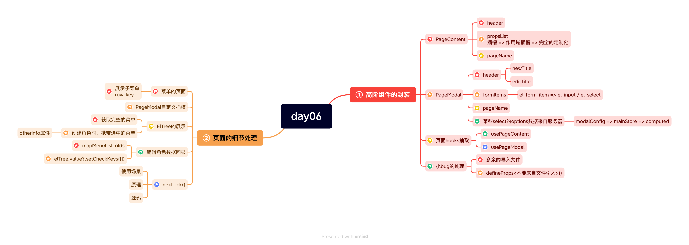

# BMS_Project_02
Vue3 + TypeScript （CodyWhy）

## 对于自动到.git文件中的文件上传自github上出现向右白色箭头无法点击访问的情况
**处理方案**
- 使用命令或者进入文件夹手动删除文件夹里面的.git 文件夹
- 执行 git rm --cached [文件夹名]
- 执行 git add [文件夹名]
- 执行 git commit -m "msg"
- 执行 git push || git push origin [branch_name]

## 每日学习内容（思维导图）
### day01


#### 项目知识点复习day01
1. 在 Vue 项目中，.tsconfig 文件是 TypeScript 编译器的配置文件。它用来设置 TypeScript 编译器的编译选项和行为，以便将 TypeScript 代码转换为 JavaScript 代码。（用来设置TS编译器的编译选项和行为）
2. 项目规范其实只要配置好其中一个就行了
3. 项目结构的初始搭建：views文件夹下的 main、login、not-found等组件的搭建
4. CSS样式的重置（这一点很关键）
5. vue-router路由的使用：先npm下载好路由；然后在router文件夹下面的index.ts文件下配置（使用vue3的组合式API进行配置路由**createRouter**，使用 **createWebHashHistory**创建路由方式等）；同时还需要在main.ts中进行注册使用
6. pinia状态管理： 在store文件夹下进行管理操作；配置文件书写在index.ts文件夹下【将创建好的“pinia”导出】；
7. axios网络请求：之前已经封装过了；
8. 区分开发环境和生产环境：3种方式～demo中见

### day02


#### 项目知识点复习day02
1. Element-plus的引入在main.ts中进行引入操作
2. CSS中vw和vh的使用；解释: 项目中的100vw和100vh表示的就是占满整个屏幕
```
在 CSS 中，vw 和 vh 都是相对于视口大小的长度单位。

vw 表示视口宽度的百分比，即 1vw 等于视口宽度的 1%。例如，如果视口宽度为 1000 像素，则 1vw 等于 10 像素。

vh 表示视口高度的百分比，即 1vh 等于视口高度的 1%。例如，如果视口高度为 800 像素，则 1vh 等于 8 像素。

这两个单位可以用来创建响应式设计，以使元素在不同的设备和屏幕尺寸下保持一定的比例和布局。
```
3. label插槽的使用（有具体名字；使用具名插槽；使用template 然后用#label来标识；里面再使用class="label"来表示）
```
<template #label>
  <div class="label">
    <el-icon><UserFilled /></el-icon>
    <span class="text">帐号登录</span>
  </div>
</template>
```
4. 在登陆组件中（login-pane）；里面又划分嵌套了两个子组件（pane-account）和（pane-phone）
5. 登陆组件的校验规则：el-form组件中的:rules是用来书写配置规则用的；具体实现可以查看文档；
6. 点击立即登陆的功能：在父组件中进行点击；在子组件中配置好ref属性，可以很完美的拿到 <pane-account ref="accountRef" />子组件上的方法，在子组件中需要通过defineExpose把方法暴露出去，具体的逻辑实现可以书写在子组件上；
7. 获取到的数据最好是不要存放在组件自身上；因为别的组件也可能会用到；放到pinia当中；
8. 其中在pinia中actions中发送网络请求的时候可以用async和await配合使用，这样结果数据就能直接获取到；不用.then()
9. 一些公用的类型可以抽取到types文件夹当中；暴露文件一般是通过index.ts进行全局暴露；
10. 对于一些常用方法：比如使用localStorage、sessionStorage来对token数据做一个保留的时候，可以将这个方法写在utils文件夹当中；

### day03


### day04 & day05


#### 项目知识点复习day04
1. 动态路由

#### 项目知识点复习day04
1. 动态路由：根据用户的权限信息，动态的添加路由（而不是一次性的注册所有的路由）
- 基于的角色（Role）动态路由管理
```
const roles = {
  "superadmin":[所有的路由],=> router.main.children
  "admin":[一部分路由]
}
```
- *弊端：每增加一个角色；都要增加一个key/value 
- 登陆的接口中请求三个内容：token;用户信息：角色信息～role对象;菜单信息
#### 项目知识点复习day04

2. 基于菜单(menu)的动态路由管理
- userMenus => 动态展示菜单
- 核心技术、商品统计、用户管理、角色管理

**总结**：第二种是更好的，更合适的

**总结**：第二是
**总结**：第二
### day05
#### 项目知识点复习
- 关于组件中的数据，想要获取最外面el-table的数据，可以使用作用域插槽
  - 作用域插槽，通过template，#default="scope"来获取；通过scope可以获取到所有的数据信息
```
<template #default="scope">
  <el-button
    size="small"
    :type="scope.row.enable ? 'primary' : 'danger'"
    plain
  >
    {{ scope.row.enable ? '启用' : '禁用' }}
  </el-button>
</template>
```
#### 项目知识点复习-table

### day06

